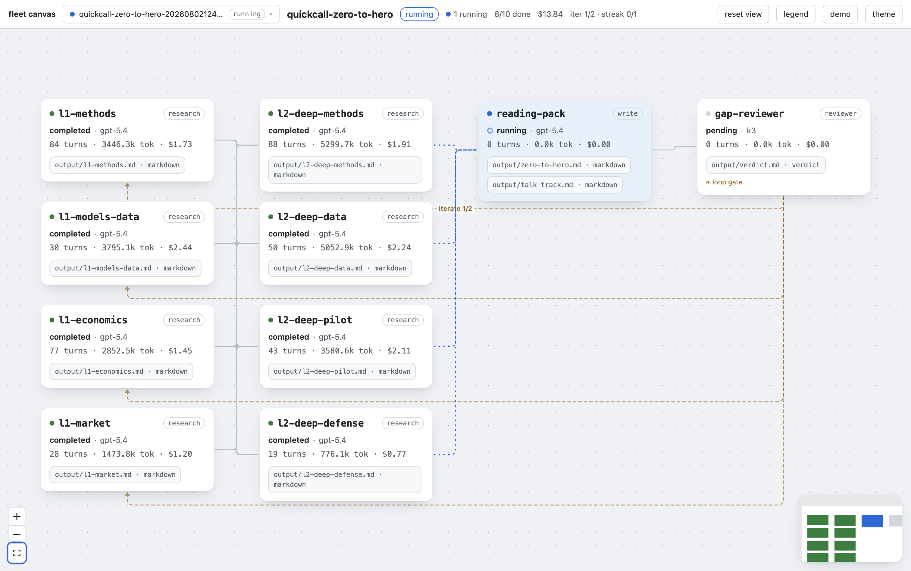
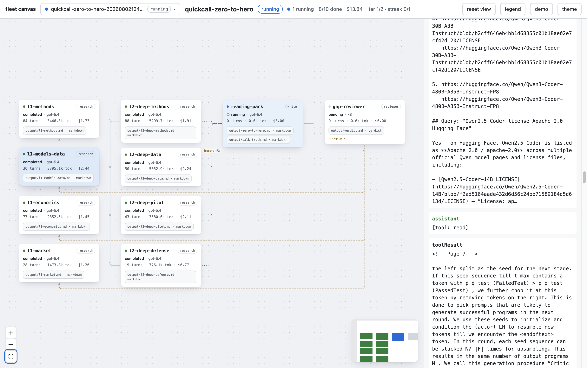

# pi-agent-fleet

DAG-of-agents fleets for [pi](https://github.com/earendil-works/pi-coding-agent). Define a fleet of worker agents as data, preview it, launch it, watch it run — with per-worker output contracts, reviewer-gated iteration loops, live cost tracking, and a machine-written report.

```
● fleet: cost-relaunch-build · iteration 1/3 · last verdict: iterate · streak 0/1 (2/3 done · $1.42)
├─ ✓ builder-pricing (kimi-for-coding) · 32 turns · 945k tok · $0.83
├─ ⠹ builder-relaunch (kimi-for-coding) · 12 turns · 401k tok · editing src/scheduler.ts…
└─ ○ reviewer (k3) · waiting on builder-relaunch
```

## Demo

Live browser canvas — per-node status, turns, tokens, cost, and click-to-peek session tail:



Node detail side panel — peek a running node's recent session without leaving the canvas:



## Why

One agent is a tool. A **fleet** is a workflow: researchers feed builders, builders feed reviewers, reviewers gate quality — all visible, all recorded, all contract-checked. Fleets run in-process via pi's SDK: any provider pi is logged into (Claude, Codex, Kimi, …) works per-node.

Philosophy: no auto-restart, no auto-kill, no babysitting. Failures surface; the operator decides. Contracts are checked at worker exit. The reviewer is the quality gate; you are the kill switch.

## Install

```bash
pi install npm:pi-agent-fleet                    # from npm
pi install git:github.com/sagarsrc/pi-agent-fleet # from git
pi install /path/to/pi-agent-fleet               # local
```

## Quickstart

Ask your pi session (the LLM drives the tools):

> Plan and launch a fleet: two parallel writers and a combiner, all gpt-5.4-mini.
> writer-a writes output/a.md containing "# 123", writer-b writes output/b.md containing "# 456",
> combiner (depends on both) writes output/sum.md with the total.
> Each declares its output as a markdown contract.

The agent calls `fleet_design` (if you describe it in prose) or `fleet_plan` (if you already have JSON), you confirm the preview, then `fleet_launch` runs it. Plan and launch responses include a fleet canvas link by default; the in-chat widget is hidden until you run `/fleet viz`. Read the report at `.fleet/<name>-<ts>/report.md`.

JSON pipeline variant — a numeric handoff chain where workers pass typed JSON, verified by schemas at contract check:

> Plan and launch the fleet defined in `examples/json-number-pipeline.json`.

One writer emits `{"values":[3,5,8]}`, two parallel consumers add and subtract, a synthesizer combines the results — each output declared as a `json` contract with a `schema` naming its required and numeric keys.

## Writing a fleet

```json
{
  "fleet_name": "auth-research",
  "type": "dag",
  "config": {
    "max_concurrent": 4,
    "model": "gpt-5.4-mini",
    "effort": "medium",
    "warn_cost_usd": 10
  },
  "workers": [
    {
      "id": "research",
      "type": "research",
      "task": "…",
      "outputs": [{ "path": "output/findings.md", "kind": "markdown", "required": true }]
    },
    {
      "id": "build",
      "type": "code-run",
      "task": "…",
      "depends_on": ["research"],
      "model": "kimi-coding/k3",
      "effort": "high",
      "outputs": [{ "path": "src/auth/login.ts", "kind": "file-exists", "required": true }]
    }
  ]
}
```

- `config.model` / `config.effort` — fleet-wide defaults; per-worker `model` and `effort` override.
- `effort` maps to pi thinking levels: `off | minimal | low | medium | high | xhigh | max`.
- `config.warn_cost_usd` — soft cost guardrail surfaced in the canvas and report.
- `iterate: false` — run the node once at iteration 1 and carry its outputs forward.
- `worktree: true` — run the node in a dedicated git worktree.
- Worker types `research`, `code-run`, `reviewer`, `write`, `read-only` each get a tailored tool set.

## Fleet modes

**One-shot DAG** — static dependency graph, parallel layers, contracts at exit.

**Iterative fleet** — reviewer-gated replay until quality passes:

```json
{
  "config": {
    "loop": { "gate": "reviewer", "max_iterations": 5, "lgtm_count": 2 }
  }
}
```

A reviewer node writes a verdict contract (`verdict: lgtm | iterate | escalate` + actionable body). `iterate` → builders get the review injected as feedback next iteration. `lgtm` × `lgtm_count` consecutive → completed. `escalate` → fleet pauses and notifies you. `gate: "none"` → free-running loop (autoresearch pattern: eval instructions live in the worker's task text).

**Worktree mode** — `worktree: true` on a node: the worker runs in a dedicated git worktree on a deterministic branch (`fleet/<fleet-name>/<node-id>`). The extension creates the worktree, commits the worker's changes, and, when two or more worktree workers exist, auto-injects a `fleet-integrator` node that merges their branches in dependency order before the agent runs. Overlapping repo-relative output paths without an ordered handoff are rejected at plan time. Merge conflicts surface as a failed integrator with a `status_note` listing the files, so the operator can resolve and relaunch.

**Run-once vs replay nodes** — `iterate: false`: node runs at iteration 1 only, outputs carry over (e.g. research that doesn't change).

## Contracts

Every worker declares `outputs[]` with kinds, verified in code at worker exit before dependents are released:

| kind | check |
|---|---|
| `markdown` | exists, non-empty, starts with `#` |
| `file-exists` | exists, non-empty (repo-relative paths = code edits) |
| `verdict` | `verdict: lgtm\|iterate\|escalate` line + non-empty body |
| `json` | parses as JSON; optional `schema` checks (below) |
| `yaml` | parses as YAML |

JSON outputs may declare a `schema` with `required_keys` (keys that must exist) and `number_keys` (keys that must be numbers or arrays of numbers). Schemas are only allowed on `kind: "json"` outputs, are injected into the worker's prompt, and are enforced at contract check. When a `schema` is present, the JSON must be a top-level object (arrays and scalars fail):

```json
{ "path": "output/sum.json", "kind": "json", "required": true,
  "schema": { "required_keys": ["operation", "result"], "number_keys": ["result"] } }
```

Failed required contract → `contract_failed`, dependents blocked, orchestrator notified. No silent passes.

## Tools & commands

| tool | purpose |
|---|---|
| `fleet_design` | draft a fleet DAG from plain-language requirements (planner agent → validated JSON + preview) |
| `fleet_plan` | validate + preview a fleet definition (no launch) |
| `fleet_models` | list available model refs (provider/id) from the live registry — call before `fleet_plan` if you don't know exact model IDs |
| `fleet_launch` | launch the planned fleet after user confirmation; `skip_confirm` for unattended runs |
| `fleet_status` | live DAG status and text summary |
| `fleet_continue` | resume a failed/killed fleet from current state without restarting completed nodes |
| `fleet_pause` / `fleet_resume` | pause/resume loop fleets at the next iteration boundary |
| `fleet_kill` | kill all, or kill a single node by worker id |
| `fleet_relaunch` | re-run a failed/killed node and its blocked downstream; optional model override |
| `fleet_add_node` | insert new workers into a running fleet mid-flight |
| `fleet_edit` | edit a pending node's model/effort/task, or fleet config mid-run |
| `fleet_report` | regenerate the fleet markdown report |
| `fleet_canvas` | open a browser canvas; `?demo=1` shows synthetic data for UI iteration |

`/fleet viz | status | clear | pause | resume | continue | kill all|<node_id> | relaunch <id> [model] | add <json> | edit <node_id>|config ... | configure [show|set k v] | canvas [open|url|stop]`

## Runtime mutation

Fleets are not frozen after launch. You can kill a single stuck node, relaunch it with a stronger model, edit a pending node's task, or inject new workers with `fleet_add_node`. Inserted nodes validate against the existing DAG (unique ids, acyclic, loop-gate rules) and start dispatching as soon as their dependencies complete.

## Preferences

Set fleet-wide defaults in `~/.pi/agent/fleet.json`:

```json
{
  "max_concurrent": 4,
  "model": "gpt-5.4-mini",
  "effort": "medium",
  "warn_cost_usd": 10
}
```

These are merged into `fleet_plan` results. Manage them with `/fleet configure show | set <key> <value>`.

## Records

Everything lands in `.fleet/<name>-<ts>/` (git-ignored): `state.json` (single source of truth, atomic writes), per-worker `prompt.md` + `session.jsonl` + outputs, per-iteration archives, and a machine-written `report.md` with per-worker turns/tokens/cost, contract results, verdict history, and git diff stats. Completed nodes keep their stats visible in the canvas and report after the fleet ends.

## Model selection and effort

Fleet-wide default via `config.model` and `config.effort`; per-node override via `worker.model` and `worker.effort`. Any model pi can resolve works, including any provider pi is logged into. Cheap models for trivial writers, strong models for reviewers:

```json
{ "id": "reviewer", "type": "reviewer", "model": "kimi-coding/k3", "effort": "high" }
```

Model refs are validated at plan and launch time so bad names fail fast. There is no baked-in default provider: the extension uses whatever pi has configured.

## Development

```bash
npm install
npm test          # 274 tests, zero-API (fake session factory)
npm run typecheck
```

Design docs are archived locally under `.archive/docs/superpowers/` (not tracked); experiment history in `docs/experiments/`.

## License

MIT
