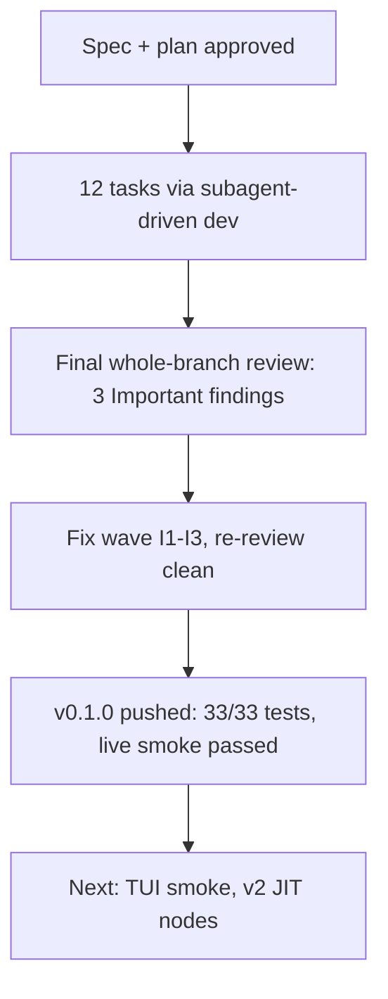

# Checkpoint 01: fleet v1 complete

## What

- Built `fleet` pi extension v0.1.0: static DAG of in-process worker agents (`createAgentSession`), per-node output contracts, ready-queue scheduler, ASCII DAG preview + confirm gate, live widget, machine-written `report.md`.
- 12 tasks, each: fresh implementer subagent → task review → fix loop if needed. All clean.
- Final whole-branch review (k3): APPROVE conditional on I1 kill-guard, I2 state tmp race, I3 path traversal — all fixed in one wave, re-reviewed clean.
- Live smoke fleet (2 workers, `gpt-5.4-mini`): both nodes `completed`, contracts ✓, report.md generated. Zero-API e2e covers pipeline via fake SessionFactory.
- 33/33 unit tests + `tsc --noEmit` clean. 17 commits, ontology format throughout.

## Key Takeaways

- In-process `createAgentSession` (tintin pi-subagents pattern) >> tmux/subprocess for extension-native fleets: live events, abort-kill, token counts free.
- Plan-text-as-transcription works: tasks with complete code in brief ran on cheapest tier (gpt-5.4) with zero fix loops; only SDK-touching (T8, T11) needed coding tier.
- `SessionManager.create(cwd, dir)` — two args, plan assumed one; brief authorized adaptation.
- Live smoke cost ~29k tokens total for 2 trivial workers on gpt-5.4-mini.

## Issues

- Cost shows $0.00 — token-only tracking, no per-model pricing lookup (v1 limitation, warn_cost_usd inert).
- UNC paths (`\\server\share`) slip I3 path validation — POSIX-inert, parked.
- Manual TUI smoke (widget rendering, confirm dialog) still pending — headless can't verify.
- Worker-mode tools (`fleet_dag_read`/`fleet_node_update`) deferred to v2 — DAG awareness is prompt-level only.

## Decisions

- Worker-mode write-scoping tools → v2 (prompt-level DAG awareness ships instead).
- Single-node kill → v1 fleet-wide only (scheduler lacks per-node abort channel).
- doc skill and fleet stay decoupled; bridge = report.md path links.
- fleet-plan skill skipped for this build: sequential task chain in shared repo, SDD forbids parallel implementers.

## Next

- Manual TUI smoke: `pi -e ./src/index.ts`, plan a fleet, watch widget + confirm gate.
- v2 candidates (spec §16): JIT node-add mid-run, iterative/looping DAGs, worker-mode tools, single-node kill, per-model cost pricing, dag.md mermaid fallback.
- Repo: https://github.com/sagarsrc/pi-fleet-extension (private)
- Key files: `src/{dag,contracts,state,viz,prompts,runner,scheduler,report,ui,index}.ts`, spec at `docs/superpowers/specs/2026-08-01-fleet-extension-design.md`, plan at `docs/superpowers/plans/2026-08-01-fleet-extension.md`
