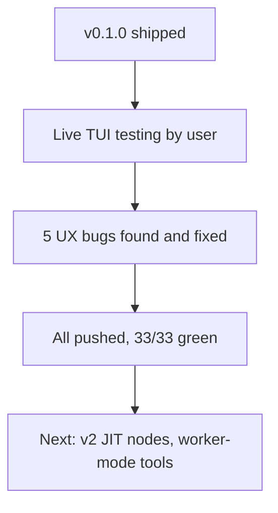

# Checkpoint 02: UX hardening pass

## What

Post-release TUI testing surfaced 5 UX issues; all fixed, committed, pushed:

1. **Widget never cleared** after fleet completion → auto-clear on finish + `/fleet clear` command
2. **`config.model` never applied** → now resolved per worker; unresolvable fleet default → warn + session default (no hard fail)
3. **No confirm bypass** → `fleet_launch({ skip_confirm: true })`
4. **LLM guessed fleet JSON shape wrong 2×** → root cause: schema-less `Type.Object({})` param. Fixed with full TypeBox schema (workers/task/depends_on/outputs/kinds all described)
5. **Double-rendered status** → `fleet_status` tool + `/fleet viz|status` returned widget lines as text, LLM echoed them. Now widget-only rendering; tool returns DAG text only

Also: models now shown in DAG preview/widget/report (`id (model)`); fleet default model `k2p6` → `gpt-5.4` (k2p6 absent on this machine); model selection standard encoded in `fleet_plan` description (cheap: gpt-5.4-mini/highspeed, coding: kimi-for-coding/gpt-5.5, review: k3/gpt-5.6-sol).

## Key Takeaways

- **Schema-less tool params = LLM guessing.** Any LLM-facing structured input needs full TypeBox schema, not `additionalProperties: true`. Validation catches errors but wastes turns.
- **Widget text must never enter tool return text** — LLM echoes it → double render. Chat content and widget content are separate channels, keep them so.
- Live smoke fleets are cheap (~30k tokens, gpt-5.4-mini) and caught every one of these — unit tests caught none (all UI-layer).

## Issues

- Old fleet skills removed from `~/.pi/agent/skills` AND `~/.agents/skills` (both were loading; canonical kept at `/Users/sagar/work/skills/skills/`)
- Cost still $0.00 (no per-model pricing)

## Decisions

- `config.model` unresolvable → warn + session default, not hard error (fleets planned on one machine may run on another)
- Confirm gate stays default-on; `skip_confirm` opt-in via prompt

## Next

- v2: JIT node-add mid-run, worker-mode tools (`fleet_dag_read`/`fleet_node_update`), single-node kill, per-model cost pricing, iterative DAGs
- Repo: https://github.com/sagarsrc/pi-fleet-extension — all commits pushed, working tree clean
