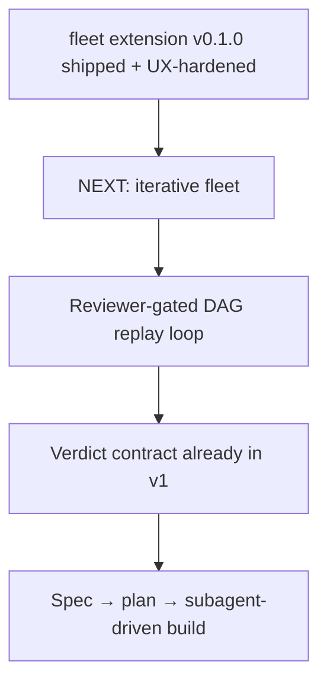

# Checkpoint 03: HANDOFF — design iterative-fleet spec



**You are picking up the design of ITERATIVE FLEET for the pi-fleet-extension project. Start by reading the files listed under "Read first". The feature is NOT started — your job is brainstorming → spec → plan → build.**

## What exists (v0.1.0, shipped, all pushed)

Repo: `/Users/sagar/work/pi-fleet-extension` — https://github.com/sagarsrc/pi-fleet-extension (private, main branch, tree clean)

A pi extension (TypeScript, ESM, vitest) that runs a **static DAG of in-process worker agents**:

- `src/dag.ts` — fleet spec validation, Kahn topo layers, cycle detection, output path traversal guard
- `src/contracts.ts` — output contract verifiers. Kinds: `markdown`, `file-exists`, `verdict`, `json`, `yaml`. **`verdict` kind already enforces `verdict: lgtm|iterate|escalate` line + non-empty body — this is the reviewer gate, already built**
- `src/state.ts` — single `state.json` per fleet, atomic unique-tmp writes, pure `patchNode`
- `src/scheduler.ts` — ready-queue dispatch, `max_concurrent`, blocked-propagation on failure, fleet-wide kill switch, contract check at worker exit
- `src/runner.ts` — wraps pi SDK `createAgentSession` per worker, injectable `SessionFactory` (zero-API tests), turn/token counting
- `src/prompts.ts` — DAG-aware worker prompts (full DAG view, upstream resolved paths, downstream requirements, output obligations)
- `src/viz.ts` / `src/ui.ts` — ASCII DAG (with per-node model labels), live widget
- `src/report.ts` — machine-written `report.md` + git diff stat
- `src/index.ts` — tools `fleet_plan` (structured TypeBox schema, `skip_confirm` on `fleet_launch`), `fleet_status`, `fleet_kill` (fleet-wide only), `fleet_report`; `/fleet viz|status|clear|kill`

Fleet root: `.fleet/<name>-<ts>/` (git-ignored). 33/33 tests, `tsc` clean. Live smoke fleets verified end-to-end.

## Read first (in order)

1. `docs/ontology.md` — vocabulary + commit format (`add:`/`update:`/`fix:`/`spec:`/`test:`/`refactor:`). Iteration + JIT-node terms already reserved for v2
2. `docs/superpowers/specs/2026-08-01-fleet-extension-design.md` — v1 spec, esp. §6 contracts, §8 scheduling, §16 deferred items
3. `docs/superpowers/plans/2026-08-01-fleet-extension.md` — how v1 was planned/built (same process will be used)
4. `src/scheduler.ts` + `src/contracts.ts` + `src/index.ts` — the code you'll extend
5. Old bash iterative-fleet skill (design provenance, DO NOT build on the bash): `/Users/sagar/work/skills/skills/iterative-fleet/SKILL.md` — concepts to port: `iterations/N/review.md`, stop conditions (max_iterations, reviewer_lgtm_count, cost cap), pause/resume via `.paused`, "orchestrator reads and decides only, NEVER kills workers"

## The feature to design

**Iterative fleet**: reviewer-gated replay of the DAG until quality gate passes.

```
loop iteration N:
  run DAG (builders ... → reviewer)
  reviewer writes review.md (verdict contract — enforced already)
  verdict: lgtm ×N-count → stop: completed
           iterate → builder prompts next iteration get "## Reviewer feedback (iteration N-1)" → replay
           escalate → pause fleet, notify operator
  caps: max_iterations, warn_cost_usd
```

## Design decisions you must resolve in the spec

1. **Replay scope**: full-DAG replay per iteration vs builders-only (reviewer re-runs always; are upstream researchers re-run?)
2. **Feedback injection**: how iteration N-1 review reaches builders (prompt section injection; where in `prompts.ts` flow)
3. **State shape**: per-iteration node history in state.json (`iterations: [{n, verdict, nodes: {...}}]`) vs flat overwrite
4. **Stop conditions**: exact config schema (`config.iterations: {max_iterations, lgtm_count, warn_cost_usd}` — proposed; validate)
5. **Pause/resume**: commands + state (old skill used `.paused` file — we banned sentinel files; use state.json field)
6. **Reviewer context**: does reviewer see inter-iteration diffs or fresh each time?
7. **Widget/report**: iteration display (`iteration 2/5 · last verdict: iterate`), report includes verdict history
8. **Philosophy invariants to preserve**: no auto-restart, no auto-kill, operator owns kills; contract checks stay at worker exit

## Process constraints (how this team works — follow exactly)

- **Brainstorm first** (superpowers:brainstorming): present design sections, get user approval, THEN write spec to `docs/superpowers/specs/2026-08-XX-iterative-fleet-design.md`, commit, user review, then writing-plans
- **TDD**: failing test → implement → pass → refactor → regression → document
- **Subagent-driven development** for the build: fresh implementer per task + task review (kimi-coding/k3) + final whole-branch review. Models: coding `kimi-coding/kimi-for-coding` or `openai-codex/gpt-5.5`; trivial `openai-codex/gpt-5.4`; review `kimi-coding/k3`
- **Testing economics**: zero-API tests via fake SessionFactory; ONE live smoke at end with `gpt-5.4-mini`, trivial tasks
- **doc skill** for docs: `/Users/sagar/work/skills/skills/doc/scripts/` (experiment 1 = `001-fleet-extension-impl`, use it)
- **Non-blocking background subagents**; never parallel implementers (shared repo)
- Git: author already configured; commit per ontology; push as you go

## Known v1 limitations (do not fix unless in scope)

- Cost shows $0.00 (token-only, no per-model pricing)
- Single-node kill/relaunch not supported (fleet-wide only) — **iterative spec MAY pull this in scope if replay design needs it**
- Worker-mode tools (`fleet_dag_read`/`fleet_node_update`) deferred

## Contact points for ambiguity

User decisions already made: iterative fleet chosen over JIT node-add (JIT later, composes later); verdict body = the review itself (not just a line); fleet stays decoupled from doc skill (report.md = bridge). Anything else ambiguous → ask the user during brainstorming, one question at a time.
