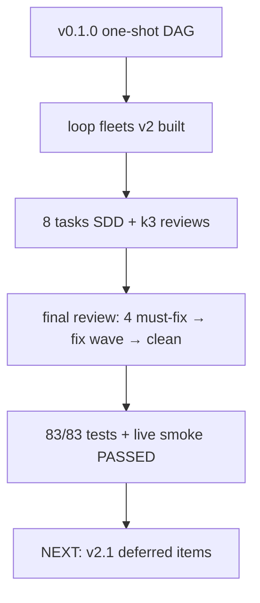

# Checkpoint 04: loop fleets shipped

## What

Unified loop fleets shipped on main (14 commits from `460d8a6`):

- **Schema**: `config.loop { gate: reviewer|none, max_iterations, lgtm_count }`, per-node `iterate` (default true) + `worktree` (default false)
- **Scheduler**: outer iteration loop around v1 inner pass; gate decisions at iteration boundary only; lgtm streak (consecutive, resets on iterate); escalate → auto-pause; max_iterations exhausted → failed; pause/resume via `pauseSwitch` + `state.paused` (no sentinels); `resumeFrom` continues with monotonic snapshot numbering
- **State**: `iterations[]` snapshots (verdict + verdict_body + cloned nodes), `readState` v1-tolerant, per-iteration archive at `iterations/<n>/workers/`
- **Prompts**: reviewer feedback injection (replay nodes, iteration > 1), `## Previous reviews` history (reviewer), `## Writing your verdict` format section, worktree directive (`git worktree add <fleetRoot>/worktrees/<id> -b fleet/<basename>/<id>`)
- **Contracts**: `ContractResult.verdict`/`verdict_body` extraction; repoCwd-as-function for worktree node path resolution
- **Tools/UI**: `fleet_pause`/`fleet_resume` + `/fleet pause|resume`; widget header `iteration n/max · last verdict · streak s/c`; report `## Iterations` table + per-node detail + verdict bodies + `## Worktree branches` (ungated from loop)
- **Validation**: 6 loop rules incl. exactly-one-verdict-sink-node, run-once may not depend on replay; launch-time `.git` fs probe for worktree fleets (zero git commands — invariant held)
- Spec: `docs/superpowers/specs/2026-08-01-loop-fleets-design.md`; plan: `docs/experiments/001-fleet-extension-impl/plans/01-loop-fleets-impl.md`

## Key Takeaways

- Live smoke PASSED E2E: 2-iteration reviewer-gated loop, feedback closed the loop (writer-a added "done" after iterate verdict), injection + history verified in archived prompts
- Smoke attempt 1 failed on reviewer writing `iterate` without `verdict: ` prefix → verdict-format prompt section added (real product gap caught only by live smoke)
- Final review caught Critical resume bug (duplicate snapshot n / archive overwrite / cap overshoot) — fixed + regression-tested in fix round 1
- 83/83 tests, tsc clean, all v1 tests unmodified throughout (byte-identical one-shot behavior)

## Issues

- None open. Parked minors with rulings in `.superpowers/sdd/01-loop-fleets-impl/progress.md` — notable: `lgtm_count > max_iterations` unguarded (fleet can never complete); stale output carryover can pass contracts on no-op replay; `snapshotIteration` started_at includes run-once nodes (duration inflation); cost still $0.00 (token-only) so `warn_cost_usd` is inert — `max_iterations` is the real cap

## Decisions

- Per-node `iterate` flag over type heuristics; reviewer sees full review history (no git-diff injection); autoresearch = `gate: none` fleet-of-one with eval in task text; worktree = prompt directive only, extension runs zero git; unified spec (iterative + autoresearch + worktree) over iterative-only
- git-repo check implemented as `.git` fs probe (not `git rev-parse`) to preserve zero-git invariant
- fleet-plan bash skill skipped for the build (wrong substrate — pi Agent subagents used)

## Next

v2.1 candidates (deferred, in priority order): per-model pricing (un-inert cost cap), plateau-triggered search injection for gate:none fleets, `lgtm_count > max_iterations` validation guard, stale-output cleanup between iterations, single-node kill/relaunch, JIT node-add, dead-session recovery. To continue: `/doc resume 1`, spec lives in `docs/superpowers/specs/`, ledger `.superpowers/sdd/01-loop-fleets-impl/progress.md`.
