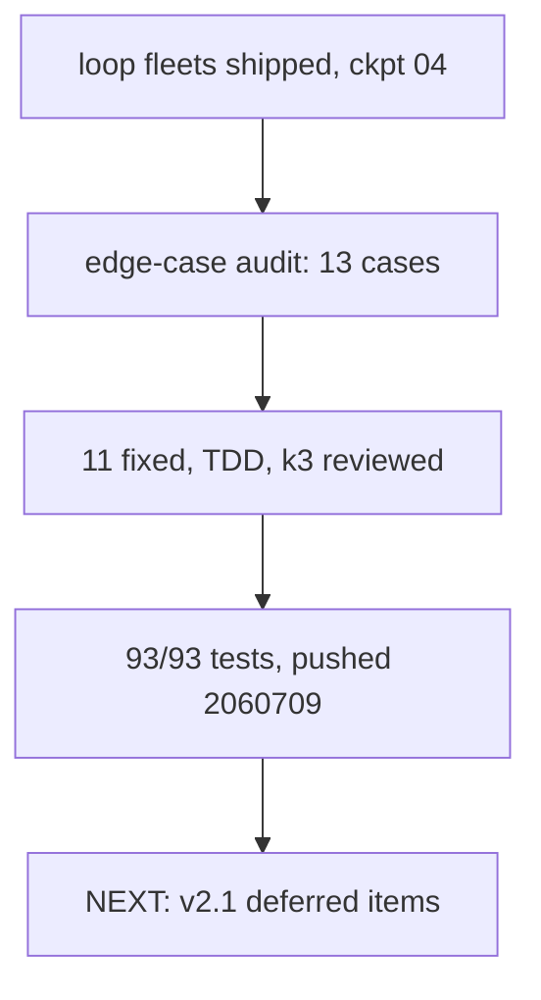

## What

- Post-ship audit: 13 edge cases identified, 11 fixed, 2 declined as bloat (rulings recorded)
- 4 fix commits `9f2b732..faf5109` + docs commit `2060709`, all pushed to main
- 93/93 tests, tsc clean; k3 review + fix round + re-review all ADDRESSED

## Fixes (details in findings/02-edge-hardening.md)

- Verdict robustness: flush-left prompt examples, case-insensitive `VERDICT_RE` (`Verdict: LGTM` parses)
- Stale-output cleanup at every iteration reset, BOTH in-loop and resume paths (`cleanReplayOutputs` in scheduler.ts) — no-op replay workers now fail instead of passing on old files
- Validation: `lgtm_count > max_iterations` rejected; gate-none all-run-once loop rejected
- snapshotIteration started_at = replay nodes only (accurate per-iteration durations)
- Widget streak reviewer-gate-only; fleet_pause rejects one-shot; git probe EACCES tolerant; escalate notify includes report path

## Key Takeaways

- Biggest hole was stale outputs passing contracts — silent corruption vector, now closed on both reset paths (review caught resume path missed on first pass)
- First live smoke caught what 83 unit tests didn't: reviewer verdict format was never taught in prompts
- Cost warn still inert ($0.00 token-only) — max_iterations is the only real cap; deliberately NOT fixed (bloat until pricing lands)

## Issues

- None open. Residual accepted risks: probe catch-all masks I/O errors (benign), gate-none widget shows `last verdict: —` (cosmetic)

## Decisions

- Cost accumulation fix declined (value always $0.00 → bloat until per-model pricing lands)
- Mid-iteration crash pause-loss accepted (dead-session recovery = v2.1 scope)

## Next

v2.1 candidates, priority order: per-model pricing (activates cost cap), plateau-triggered search injection for gate:none fleets, single-node kill/relaunch, JIT node-add, dead-session recovery. Resume: `/doc resume 1`. Full history: ckpt 04 (ship), findings 01 (smoke) + 02 (hardening).
