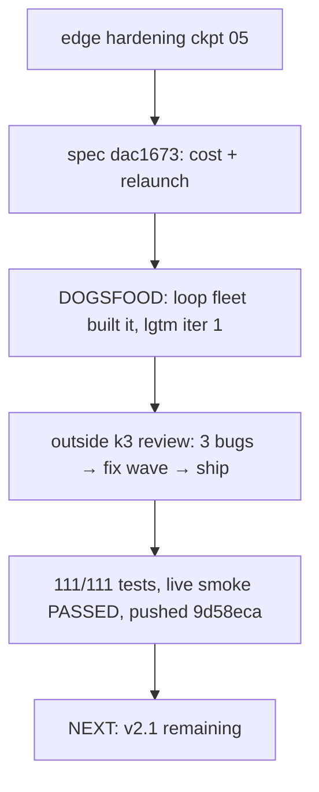

## What

- **Cost tracking real**: pi-ai `usage.cost.total` piped runner→state→widget/report; `warn_cost_usd` fires; fleet total accumulates across iterations (snapshots own iteration costs, live zeroed at snapshot)
- **Node relaunch**: `fleet_relaunch { node_id, model? }` + `/fleet relaunch` — reset failed node + blocked downstream, optional model override (any pi-logged-in provider), persisted to fleet.json; `continuePass` scheduler mode
- **Built by the extension itself**: tmux pi session (`tmux attach -t fleet-orch`) drove loop fleet `cost-relaunch-build`, in-fleet k3 reviewer lgtm iteration 1
- Extension installed globally (`pi install ./`) — loads from live source in any pi session

## Key Takeaways

- **In-fleet review ≠ independent review.** Fleet reviewer said lgtm; outside k3 found 3 real bugs (killed-fleet relaunch re-kills, paused relaunch re-pauses, cost double-count). Always run outside review after dogfood builds.
- Live smoke proved the exact user case: bogus model (quota-outage analog) → fail → relaunch with different provider/model → completed, $0.0068 real cost recorded
- Multi-provider was already free via pi registry — no build needed

## Issues

- None open. Parked: costWarned re-fires on resume (cosmetic), loop-fleet report Nodes column $0.00 post-snapshot (totals correct, in Iterations table), minor test-coverage swap

## Decisions

- Cost ownership: snapshots own iteration costs; live counters zero at snapshot → disjoint accumulation by construction
- killSwitch/pauseSwitch cleared in relaunch path explicitly (not startLoop — fresh plans create new switches)
- Plateau search + dead-session recovery remain deferred (user ruling)

## Next

Remaining v2.1: dead-session recovery (user declined for now), plateau search (defer until first real autoresearch run), JIT node-add (large). Dogfood tmux session `fleet-orch` still running — reuse or kill. Resume: `/doc resume 1`.
