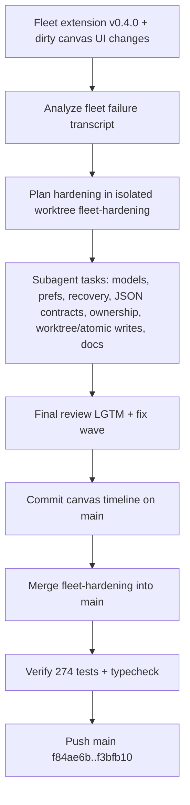

## What
- Analyzed `problems-with-fleet.jsonl` with section subagents; identified failure classes: skill-gate bypass, model ID guessing, launch/status confusion, late architecture correction.
- Built hardening branch `fleet-hardening` in `.worktrees/fleet-hardening` using subagent-driven development.
- Shipped: strict model resolution + `fleet_models`, registry-validated preferences, disk fleet recovery + next-action status/report, JSON output schemas, `examples/json-number-pipeline.json`, repo-output ownership validation, safe worktree recreation, atomic `fleet.json` writes, recovered-kill guards.
- Committed canvas timeline UI on main (`34cb5d4`), merged fleet branch (`f3bfb10`), pushed `main` to origin.
- Verified merged result: `npm test` = 41 files / 274 passed; `npm run typecheck` = clean.

## Key Takeaways
- Main failure mode was not one bug; it was missing guardrails around model registry, recovery, contracts, and operator next actions.
- Canvas changes were orthogonal UI/session-timeline work and merged cleanly with fleet recovery changes in `src/canvas.ts`.
- Dead-simple JSON pipeline example is now the canonical smoke shape: producer writes `output/numbers.json`; add/subtract workers consume; synthesizer writes `output/final.json`.

## Issues
- Stale zero-byte `.git/index.lock` blocked canvas commit; verified no active git writer and removed it.
- Final review found incomplete kill guard: `killFleet("all")` bypassed recovered-running protection. Fixed in `1a14b53`.
- Left local untracked scratch/analysis files after push; cleanup planned separately.

## Decisions
- Used isolated worktree because main checkout had unrelated dirty canvas files.
- Kept branch changes off main until final review LGTM, then merged with `--no-ff`.
- Did not commit analysis scratch files (`fleet_chunks/`, summaries, transcript exports).
- Chose safe integration: commit canvas first, merge fleet branch second, verify, then push.

## Next
- Clean local scratch files per cleanup plan; keep reusable demo/learning docs only if referenced.
- Optional follow-ups from ledger: recovered `fleet_relaunch/edit/add_node` still need active in-memory fleet; ownership handoff is direct-dep only; `writePlanFiles` initial `fleet.json` write is still non-atomic pre-launch.
- Reusable commands:
  - Verify: `npm test && npm run typecheck`
  - Demo canvas: `npx tsx .archive/scripts/serve-demo.ts` then open `http://127.0.0.1:52000/?demo=1` (local archive only, not tracked)
  - JSON pipeline example: `examples/json-number-pipeline.json`
